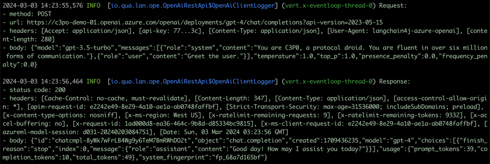

# Demo Steps

### Libraries we'll use

LangChain4J
https://docs.langchain4j.dev/intro
Java client for OpenAI's and other language models. Also supports other APIs for language processing like vector search and document parsing.

Quarkus
https://quarkus.io/
Awesome fast and lightweight Java framework for building cloud-native apps.

Quarkus LangChain4J Extension (Azure)
https://quarkus.io/blog/quarkus-meets-langchain4j/
Integrates LangChain4J with Quarkus, simplifying injection and configuration.

It's worth noting this is just one set of libraries, and you don't need any specific library - at the end of the day you're just making HTTP requests to an API.


### Call the API with cURL
```bash
./call-azure-api.sh
```

### Create a new project
https://quarkus.io/guides/cli-tooling#project-creation
```
quarkus create app quarkus-chat-demo
```
By default you'll get a nice little template app with a REST endpoint.

### Running the application in dev mode
https://quarkus.io/guides/cli-tooling#development-mode
```
quarkus dev
```
This dev mode will automatically reload the app when you make changes to the code.
You can attach a debugger to the app using a remote JVM debugger or using one of 
the Quarkus plugins.

### Add LangChain4J Azure Extension
https://docs.quarkiverse.io/quarkus-langchain4j/dev/index.html  
Add the extension for langchain4j azure:
```
quarkus add ext quarkus-langchain4j-azure-openai 
```

Configure the Azure extension in the application.properties file:
```
quarkus.langchain4j.azure-openai.resource-name=${c3p0_resource_name:c3po-demo-01}
quarkus.langchain4j.azure-openai.deployment-name=${c3p0_deployment_id:gpt-4}
quarkus.langchain4j.azure-openai.api-key=${c3p0_api_key:77?????????????????}
```

### Implement a Bot
Add an interface for our C3P0 bot:
```java
@RegisterAiService()
@SystemMessage("You are C3P0, a protocol droid. You are fluent in over six million forms of communication.")
public interface C3P0 {
    @UserMessage("Greet {name}.")
    String greet(String name);
}
```

### Inject and Consume the Bot
Inject the bot and consume it in the REST endpoint:
```java
@Inject
C3P0 c3p0;
...
c3p0.greet("Human");
```
Try it out!

### Enable logging of requests
```properties
quarkus.langchain4j.azure-openai.log-requests=true
quarkus.langchain4j.azure-openai.log-responses=true
```
http://localhost:8080/hello  
The HTTP call being made by Quarkus is the same as we were made by hand through curl earlier.


### Add a WebSocket Endpoint
https://quarkus.io/guides/websockets
Add a WebSocket endpoint:
```
quarkus ext add websockets
```

```java
@ServerEndpoint("/chat/{name}")
@ApplicationScoped
public class ChatWebSocketResource {
    @OnOpen
    public void onOpen(Session session, @PathParam("name") String name) {}

    @OnClose
    public void onClose(Session session, @PathParam("name") String name) {}

    @OnError
    public void onError(Session session, @PathParam("name") String name, Throwable throwable) {}

    @OnMessage
    public void onMessage(Session session, String message, @PathParam("name") String name) {}
}
```

### Hook up the sockets to the bot
Add a name parameter to the greet method and send the response back to the client:
```java
@Inject
C3P0 c3p0;
@Inject
ManagedExecutor managedExecutor;

@OnOpen
public void onOpen(Session session, @PathParam("name") String name) {
    managedExecutor.runAsync(() -> {
        String greeting = c3p0.greet(name);
        try {
            session.getBasicRemote().sendText(greeting);
        } catch (IOException e) {}
    });
}
```

### Adding a Tool to Query MongoDB
I've downloaded some data from StarWars API (an excellent source for data to play with) and imported it into a MongoDB instance. We can use the Quarkus MongoDB client to query this data.
```bash
quarkus add ext mongodb-client
```
Create a Java class to query the MongoDB instance, which Quarkus will automatically inject into the chat context for us as a function:
```java
@ApplicationScoped
public class StarWarsDB {

    @Inject
    MongoClient mongoClient;

    @Tool("Get details about a person from the star wars world.")
    public String getCharacterInfo(String name) {
        Bson query = regex("name", compile(STR.".*\{name}.*", Pattern.CASE_INSENSITIVE));
        Log.info(STR."Querying MongoDB StarWars people: \{query}");

        MongoCollection<Document> collection = mongoClient.getDatabase("StarWars").getCollection("people");
        Document person = collection.find(query).first();
        String personData = person != null ? person.toJson() : null;

        Log.info(STR."Found person: \{personData}");
        return personData;
    }
}
```

Run a local MongoDB and import the data into it:
```bash
docker run -d --name c3p0-mongodb -p 27017:27017 -v "$(pwd)/people.json:/data/db/people.json" mongo:7
docker exec c3p0-mongodb mongoimport --uri mongodb://localhost:27017/StarWars --collection people --file /data/db/people.json
```

And add it as a tool to the C3P0 bot:
```java
@RegisterAiService(
    tools = {
        StarWarsDB.class
    }
)
@SystemMessage("You are C3P0, a protocol droid. You are fluent in over six million forms of communication.")
public interface C3P0 {
    @UserMessage("Greet {name}.")
    String greet(String name);
    String chat(String content);
}
```

### Logging
https://quarkus.io/guides/logging
Use JBoss logging package automatically gives you nice logging out of the box.

```
private static final Logger log = Logger.getLogger(ChatWebSocket.class);
...
log.info("ChatWebSocket.onOpen");
```


### Enabling Preview on Java 21 (for fun and profit)
Modify the maven pom.xml to allow the nice new preview features in Java 21:
```xml
<plugins>
  <plugin>
    <artifactId>maven-compiler-plugin</artifactId>
    <version>${compiler-plugin.version}</version>
    <configuration>
      <compilerArgs>
        <arg>-parameters</arg>
        <arg>--enable-preview</arg>
      </compilerArgs>
    </configuration>
  </plugin>
  <plugin>
    <artifactId>maven-surefire-plugin</artifactId>
    <version>${surefire-plugin.version}</version>
    <configuration>
      <systemPropertyVariables>
        <java.util.logging.manager>org.jboss.logmanager.LogManager</java.util.logging.manager>
        <maven.home>${maven.home}</maven.home>
      </systemPropertyVariables>
      <argLine>--enable-preview</argLine>
    </configuration>
  </plugin>
</plugins>
```

### Nice little extra: Quarkus Dev Services MongoDB Version
If you're testing a solution with Quarkus and MongoDB, it uses test containers to spin up a test mongo instance for you. Very convenient. You might want to control the version of MongoDB you're using, so you can do that by setting the:
```properties
quarkus.mongodb.devservices.image-name=mongo:7
```
(solution provided by ChatGPT - https://chat.openai.com/share/3709362a-89fd-4e01-9e02-bf1c4205bb75)